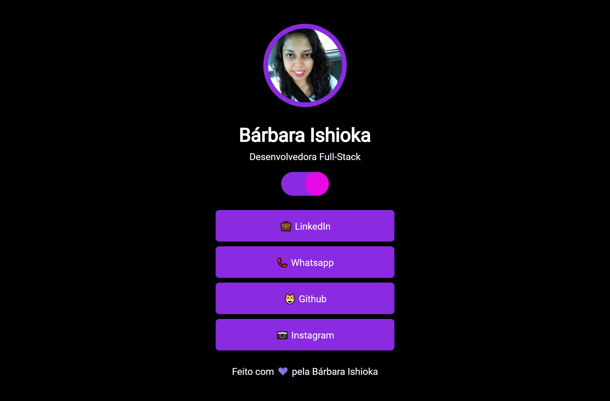

# Maratona Explorer 2.0

Uma aplicação no formato One Page que tem como objetivo centralizar links de contato de um usuário. De forma prática e elegante, será possível centralizar todos os canais onde você está disponível para contato.

Adicionei um botão toggle theme (light / dark), aprimorando a página!

[Projeto online](https://barbaraishioka.github.io/maratona-explorer-2.0)

[Figma](https://www.figma.com/community/file/1125601602315782027)



## Tecnologias

- HTML
- CSS
- Javascript

## Instalação

```bash
git clone https://github.com/barbaraishioka/maratona-explorer-2.0.git

cd maratona-explorer-2.0
```

## Licença

Este projeto está licenciado sob os termos da Licença MIT.
